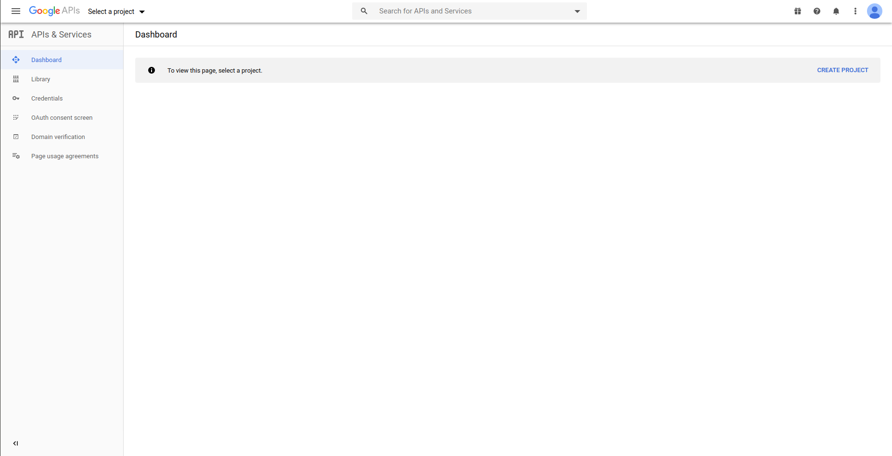
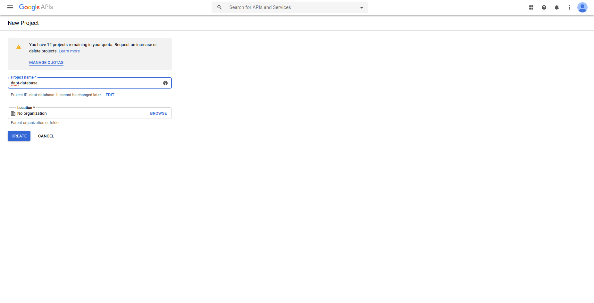
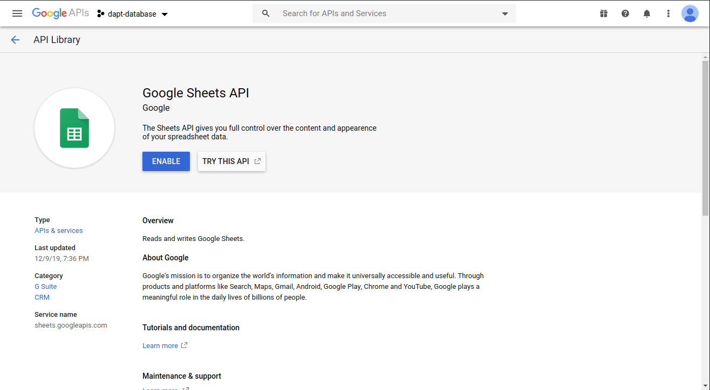
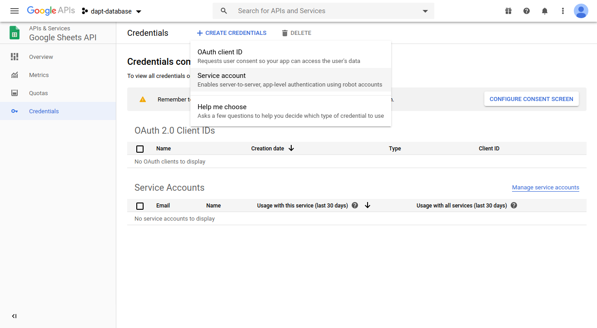
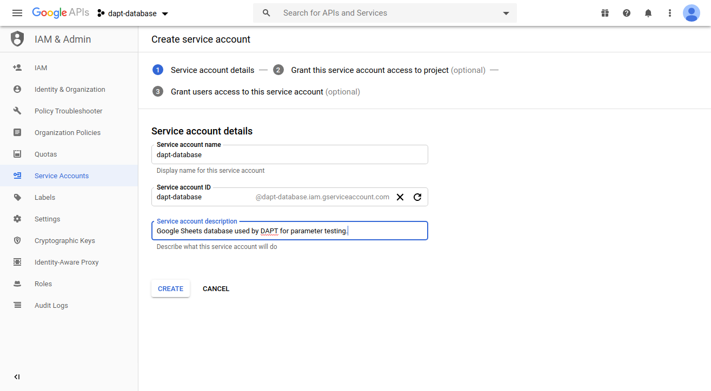
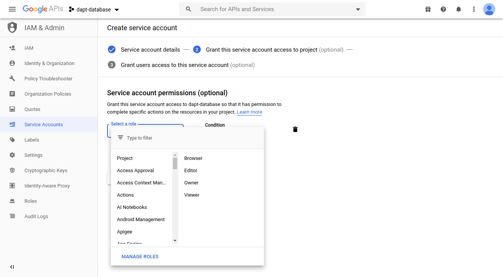
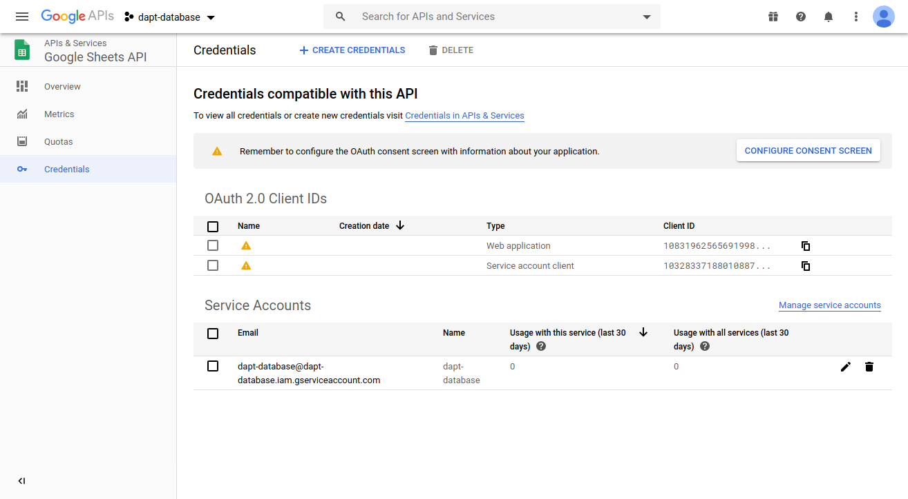
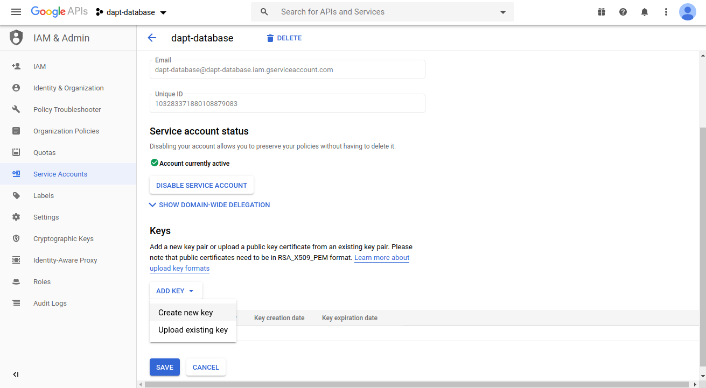

.. _google-drive-install:

Google Drive Installation
==========================

Google Drive can be used to fetch data before running a test or upload data after finishing a test.

Get API Credentials
-------------------

To use Google Sheets you will need to use the Google Sheets API and generate the proper credentials.  

1. Start by going to the `Google Developer Console <https://console.developers.google.com>`_ and login using a Google account.

2. Create a new project by selecting the button labeled "CREATE PROJECT".  If you have already created a project or do not see the button, selecting the down arrow next in the top left corner of the page next to the "Google API" logo and clicking "New Project".

3. Give the project a name and press "CREATE".

4. Click "ENABLE APIS AND SERVICES", search for "Google Sheets API" and click it.  Then click "Enable".

5. Click the "Credentials" tab from the menu on the left side of the page.  Click the dropdown at the top of the page that says "CREATE CREDENTIALS" and select "Service account".  

6. Give the service a name and click "Create".  

7. In the next section asking about service account permissions, create a role with by selecting "Project" then "Editor".  Then select "Continue".

8. On step three of creating the credentials, click "DONE".

9. You should now be on the credentials page of the Google Sheets API.  Under Service Account you should see an entry with the name of the account you just created.  Record the email address given there.  You will need to share the Google Sheet acting as a database with it.  The email address should end in ``.iam.gserviceaccount.com``.

10. To get the credentials needed by DAPT click on the pen on the right side of the Service Account.

11. Under the "Keys" section, select "ADD KEY", then "Create new key".  Ensure the key type of "JSON" is selected and click "CREATE".  A JSON file should then start downloading to your computer.  You will give DAPT the path to this JSON file when using Google Sheets.  Then click "DONE".

Python Libraries
----------------

``pip install --upgrade google-api-python-client google-auth-httplib2 google-auth-oauthlib``
